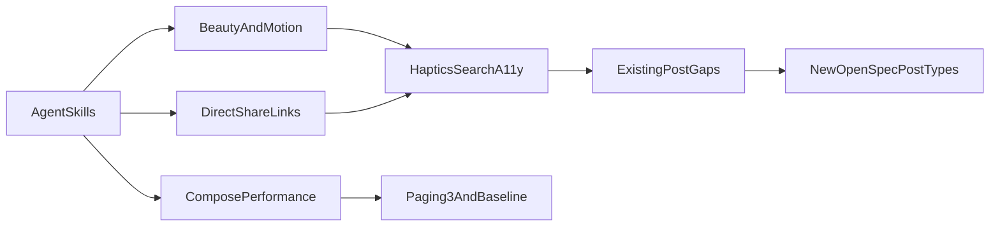
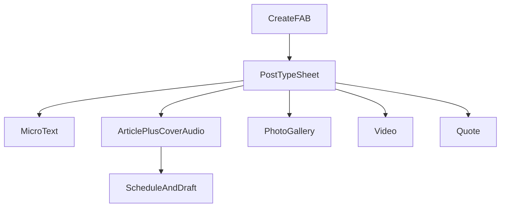

# پلن اندروید: اسکیل، زیبایی، عملکرد، تعامل، انواع پست

اپ نیتیو در `[android/](android/)` با Kotlin + Compose + Material 3 است (`applicationId` `ir.xilo.app`، minSdk 24). مرجع بصری `[openspec/changes/xilo-platform/specs/ui-ux-spec.md](openspec/changes/xilo-platform/specs/ui-ux-spec.md)` است؛ گیت پذیرش در `[openspec/changes/android-native-production/tasks.md](openspec/changes/android-native-production/tasks.md)` هنوز عمدتاً تیک‌نخورده است در حالی که خیلی از سطح‌ها قبلاً پیاده شده‌اند.

اسکیل داخلی `[xilo-android](AGENTS.md)` در AGENTS.md آمده ولی وجود ندارد؛ فقط `[xilo-mobile](.opencode/skills/xilo-mobile/SKILL.md)` (Flutter) هست که برای این کار منسوخ است.

---

## ۱) اسکیل‌های AI که باید نصب شوند

نصب در `.cursor/skills/` پروژه (قابل اشتراک در گیت) یا با `-g` برای همهٔ پروژه‌ها. **اسکیل MVI اجباری haidrrrry را نصب نکنیم** — با MVVM/StateFlow فعلی Xilo در تضاد است.

**لایهٔ رسمی Google** ([android/skills](https://github.com/android/skills)، ~7.2k ستاره):

- `system/edge-to-edge` — اینست و IME
- `jetpack-compose/theming` — Material 3 و توکن
- `jetpack-compose/adaptive` — تبلت/عرض متغیر
- `navigation/navigation-3` — Nav3 که الان در اپ هست
- `performance/r8-analyzer` — باینری و R8 برای گیت ANP-4.2
- `testing/testing-setup` — Compose UI / Macrobenchmark
- `build-system/agp` — ارتقای AGP در صورت نیاز

نصب نمونه: `android skills add --skill=edge-to-edge --project=.` (و بقیه) یا کل کاتالوگ با `--all` و بعد حذف wear/tv/xr/camera که به Xilo نمی‌خورند.

**لایهٔ Compose باکیفیت:**

- [chrisbanes/skills](https://github.com/chrisbanes/skills) (~1k ستاره): `compose-state-and-effects`, `compose-performance`, `compose-animations`, `compose-component-design`, `compose-ui-testing-patterns`, `kotlin-concurrency-and-flow`
  - `npx skills add chrisbanes/skills`
- [skydoves/compose-performance-skills](https://github.com/skydoves/compose-performance-skills) (~496 ستاره): `optimizing-lazy-layouts`, `diagnosing-compose-stability`, Baseline Profile / Macrobenchmark
  - کلون + اسکریپت نصب به `.cursor/skills/` (CLI گوگل این ریپو را ندارد)

**لایهٔ زیبایی / ضد-slop (برای اسکرین کامپوز، نه وب):**

- Anthropic `frontend-design` — جلوگیری از UI قالبی
- [nextlevelbuilder/ui-ux-pro-max-skill](https://github.com/nextlevelbuilder/ui-ux-pro-max-skill) — توکن، پالت، چک‌لیست UX
- [Leonxlnx/taste-skill](https://github.com/Leonxlnx/taste-skill): `design-taste-frontend` + `imagegen-frontend-mobile` برای مرجع تصویری موبایل قبل از کد

**اسکیل اختصاصی Xilo (باید نوشته شود):**

جایگزین Flutter-skill با `.cursor/skills/xilo-android/SKILL.md` و به‌روزرسانی AGENTS.md:

- معماری واقعی: presentation/ViewModel/StateFlow، Hilt، Room outbox، Nav3
- معماری واقعی: presentation/ViewModel/StateFlow، Hilt، Room outbox، Nav3 — نه MVI اجباری و نه Flutter
- Vazirmatn + Inter طبق اسپک؛ Noto Sans Arabic برای `ar` (`ui-ux-spec` §3). فایل‌های `inter_*.ttf` الان در `res/font/` هستند ولی Typography آن‌ها را وصل نکرده
- ممنوعیت: `collectAsState()` روی اسکرین، Lazy بدون `key`/`contentType`، استرینگ هاردکد، FAB بدون `stringResource`، چیپ فیلتر بدون پارامتر API
- ارجاع به ui-ux-spec (حباب‌ها، heading یک‌ردیفه، ژست §10.1، توکن رنگ `#1D9BF0`)

بعد از نصب، هر کار UI/عملکرد باید اول SKILL مربوط را بخواند؛ برای بازطراحی صفحه از ساب‌ایجنت UI-UX Master با مدل `composer-2.5` استفاده شود.

---

## ۲) وضعیت فعلی در برابر اسپک

پیاده شده و نسبتاً کامل: Auth، Onboarding، Feed، Discover (جستجوی واقعی اینجاست)، چت DM/گروه، پروفایل، فالو، Saved hub، نوتیف، تنظیمات/دستگاه/فولدر، نقل‌قول پست/کامنت، ریپست، بوکمارک، هشتگ، پلیر صوتی Media3 در دیتیل، edge-to-edge در `[MainActivity.kt](android/app/src/main/java/ir/xilo/app/MainActivity.kt)`، دیزاین سیستم نزدیک X/تلگرام.

گیت‌های OpenSpec که هنوز بازند ولی روی کار زیبایی/عملکرد اثر دارند: ANP-2.2 (Paging)، ANP-2.3 (آپلود مدیا + لیست درفت سرور)، ANP-3.2/3.3 (چت آفلاین و همگام‌سازی)، ANP-3.4 (i18n کامل)، ANP-4.1 (درآمد)، ANP-4.2 (Baseline Profile، TalkBack، کنتراست).

---

## ۳) شکاف زیبایی و سطح‌های ناقص (از ممیزی کد)

- **فونت:** اسپک Vazirmatn (فا) + Inter (LTR) + Noto Sans Arabic (ar) است؛ اپ YekanBakh/IranSansX دارد. `inter_*.ttf` در `res/font/` هست و به Typography وصل نیست.
- **جستجوی خانه مرده:** در [`FeedScreen.kt`](android/app/src/main/java/ir/xilo/app/ui/feed/FeedScreen.kt) نوار سرچ `.clickable { }` است.
- **چیپ دستهٔ فید تزئینی:** `FeedViewModel.selectCategory()` فقط `refreshFeed()` می‌زند؛ پارامتر category به API نمی‌رود. کاربر فیلتر می‌بیند ولی محتوا عوض نمی‌شود.
- **کامپوزر فقیر:** [`CreatePostScreen.kt`](android/app/src/main/java/ir/xilo/app/ui/feed/CreatePostScreen.kt) title + textarea + صوت. `CreatePostRequest` فیلد `coverImageUrl` / `category` / `isPremium` دارد ولی UI ندارد. بدنه روی سیم به‌صورت Tiptap ساده از متن ساخته می‌شود (`PostRepository.buildTiptapDoc()`)، ادیتور غنی نیست.
- **کارت فید:** بدون `contentType`؛ کاور فقط خواندنی؛ واکنش فقط قلب نه ۱۰ ایموجی REQ-POST-007؛ `TelegramNotificationCard` دکمهٔ More خالی.
- **پروفایل:** تب Archived برای صاحب پروفایل همیشه empty است؛ `ProfileViewModel` پست آرشیو را لود نمی‌کند در حالی که `archivePost` از منوی مالک کار می‌کند.
- **جزئیات مخاطب:** دکمه‌های Call/Video/Mute/Search/More بدون `onClick`؛ تب media/GIF پوستهٔ خالی. تماس در اسپک چت نیست — یا پنهان شود یا با «به‌زودی» واقعی.
- **کیف پول تنظیمات:** `settings_coming_soon`؛ `isPremium` در DTO بدون UI (ANP-4.1 جدا).
- **i18n/a11y:** FAB `"ایجاد پست جدید"` در [`MainScreen.kt`](android/app/src/main/java/ir/xilo/app/ui/main/MainScreen.kt)؛ چت `"بازگشت"`؛ `"Avatar"` / `"Verified"` هاردکد انگلیسی.
- **موشن:** توکن‌های `ui-ux-spec` §9 پیاده نشده؛ ژست‌های §10.1 (double-tap like، long-press، swipe reply) ناقص؛ haptic در REQ-AND نیست ولی در تجربهٔ تلگرام لازم است.
- **لیست‌ها:** Feed/Discover/چت `LazyColumn` دستی؛ فقط FollowList cursor `loadMore` دارد.

---

## ۴) شکاف عملکرد (REQ-AND-011)

- Paging 3 فقط در `[build.gradle.kts](android/app/build.gradle.kts)` است؛ `[FeedViewModel](android/app/src/main/java/ir/xilo/app/ui/feed/FeedViewModel.kt)` کل لیست Room را می‌گیرد.
- تقریباً همهٔ اسکرین‌ها `collectAsState()` دارند؛ فقط `MainActivity`/`Navigation` از `collectAsStateWithLifecycle` استفاده می‌کنند.
- هیچ Baseline Profile / Macrobenchmark ماژولی نیست؛ گیت ۱.۵ثانیه cold start و ۹۵٪ فریم در بودجه اندازه‌گیری نمی‌شود.
- Coil بدون `size`/`crossfade` مشخص روی کاور فید؛ خطر decode بزرگ هنگام اسکرول.
- بدون `LazyLayout` cache window / `contentType`؛ HorizontalPager چهار تب همه را زنده نگه می‌دارد (پروفایل را عمداً، بقیه هزینهٔ حافظه).
- R8 برای ریلیز هست ولی اسکیل r8-analyzer روی قوانین keep اجرا نشده.

---

## ۵) تعامل بهتر با کاربر

بدون نوع پست جدید، روی سطح فعلی:

- وصل کردن نوار جستجوی خانه به Discover با فوکوس کیبورد؛ ژست swipe از خانه به Discover هم‌تراز pager فعلی.
- FAB ساخت پست: منوی نوع (متن / مقاله / نقل‌قول / صوت) به سبک تلگرام attach sheet.
- لایک: haptic سبک + double-tap روی تصویر کاور (الگوی اینستا، سازگار با heartBeat اسپک).
- Long-press روی کارت: پیش‌نمایش سریع / منوی ریپست-نقل‌قول-بوکمارک-گزارش.
- واکنش چندایموجی روی پست (REQ-POST-007). در چت: ایونت ری‌اکشن وب‌سوکت الان در [`ChatRealtimeReconciler`](android/app/src/main/java/ir/xilo/app/data/remote/websocket/ChatRealtimeReconciler.kt) می‌آید ولی در Room ذخیره نمی‌شود و در UI پیام دیده نمی‌شود — long-press بی‌فایده است تا persist شود.
- چیپ‌های فید را به فیلتر واقعی API وصل کن یا تا آماده شدن API مخفی/غیرفعال کن تا حس شکستن ندهد.
- تب Archived پروفایل را از API پر کن یا تا آماده شدن نشان نده.
- دکمه‌های مردهٔ ContactDetail را بردار یا disable با توضیح؛ تماس/ویدئو در `chat-spec` نیستند (مفهوم `ui-ux-visual-concept` غیرnormative).
- Undo اسنک‌بار بعد از آرشیو/حذف/بوکمارک.
- Empty state خانه: CTA «موضوع انتخاب کن» / «افراد را دنبال کن» به‌جای فقط متن رفرش.
- پیش‌نویس محلی از قبل هست (`ComposeDraftStore`)؛ باید chip «ادامهٔ پیش‌نویس» روی FAB دیده شود.
- دسترسی: TalkBack روی اکشن‌های پست، کاهش حرکت در تنظیمات، حداقل ۴۸dp تاچ‌تارگت.
- نوتیف badge الان هست؛ deep link به کامنت/چت را روی امولاتور به‌صورت جریان کامل چک کنیم.

---

## ۶) لینک اشتراک و دیپ‌لینک (وب + اندروید) — الان خراب است

قرارداد عمومی سایت در [`web/.env.production.example`](web/.env.production.example) برابر `NEXT_PUBLIC_URL=https://aile.ir` است. مسیر پست روی وب [`/{username}/{slug}`](web/src/app/[username]/[slug]/page.tsx) است، نه `/p/{slug}`.

**باگ فعلی:**

- اندروید پست ([PostCard.kt](android/app/src/main/java/ir/xilo/app/ui/feed/PostCard.kt)، [PostDetailScreen.kt](android/app/src/main/java/ir/xilo/app/ui/postdetail/PostDetailScreen.kt)): متن اشتراک `\n/p/{slug}` است — مسیر نسبی، غیرقابل‌کلیک در پیام‌رسان، و با روت وب جور نیست.
- اندروید کامنت ([CommentCard.kt](android/app/src/main/java/ir/xilo/app/ui/components/CommentCard.kt)): `/{author}/{slug}?reply=` بدون `https://`.
- اندروید پروفایل: [profile_share_text](android/app/src/main/res/values/strings.xml) فقط `@handle در آیله` است؛ هیچ URLی نیست.
- مانیفست [AndroidManifest.xml](android/app/src/main/AndroidManifest.xml) فیلتر `VIEW`/`https` ندارد؛ لینک وب اپ را باز نمی‌کند.
- وب پست ([post-card.tsx](web/src/components/post/post-card.tsx)): `window.location.origin + href`؛ اگر `author.username` نباشد می‌شود `/{slug}` که صفحهٔ پروفایل است. فقط clipboard، بدون `navigator.share` و بدون توست. از `NEXT_PUBLIC_URL` استفاده نمی‌کند پس در لوکال/پیش‌نمایش لینک اشتباه پخش می‌شود.
- صفحهٔ پست `generateMetadata` / `og:url` / canonical ندارد (REQ-SEO-003)؛ پیش‌نمایش واتساپ/تلگرام خالی یا غلط می‌ماند.

**قرارداد لینک مستقیم:**

- پست: `https://aile.ir/{username}/{slug}`
- کامنت: `https://aile.ir/{username}/{slug}?reply={commentId}`
- پروفایل: `https://aile.ir/{username}`
- اختیاری: ریدایرکت وب `/p/{slug}` به canonical تا لینک‌های قدیمی نشکنند

پیاده‌سازی:

- هلپر وب `web/src/lib/share-urls.ts`: پایه از `NEXT_PUBLIC_URL`. `shareOrCopy(url, title)` با Web Share API و fallback کلیپبورد+feedback.
- هلپر اندروید + `BuildConfig.PUBLIC_WEB_URL` از `xilo.webBaseUrl` / `XILO_WEB_BASE_URL`. متن اشتراک: عنوان سپس یک خط URL مطلق `https`.
- intent-filter App Links برای `https` روی هاست عمومی + پارس در `MainActivity` به `PostDetailKey` / `ProfileKey`.
- metadata پست وب: `og:url`، canonical، twitter card از همان URL.

تست واحد برای ساخت URL (username خالی، reply). تأیید دستی: اشتراک از فید اندروید و کارت وب در تلگرام باید لینک قابل‌بازشدن به همان پست بدهد.

---

## ۷) انواع پست — نردبان

**الف) موجود و باید تکمیل شود (بدون اسپک جدید):**

- مقاله/بلاگ: title + بدنه؛ الان textarea ساده است → حداقل Markdown یا subset غنی هم‌تراز Tiptap وب (الان `buildTiptapDoc()` فقط یک پاراگراف می‌سازد).
- نقل‌قول پست و نقل‌قول کامنت — UI هست؛ پولیش امبد.
- ریپست ساده — هست (Author+).
- صوت الصاق‌شده به پست ([`post-audio`](openspec/changes/post-audio/proposal.md)) — هست.
- کاور تصویر: رندر هست، آپلود در کامپوزر نیست.
- زمان‌بندی انتشار: REQ-POST-010؛ UI اندروید نیست.
- دسته/تگ در ایجاد پست: فیلد DTO هست، کامپوزر نفرستاده.
- پیام ویدئوی چت تا ۱۰۰MB (REQ-CHAT-002) — کامپوزر چت الان عکس می‌فرستد نه ویدئو؛ این نوع پست فید نیست، گپ چت است.

**ب) پیشنهاد OpenSpec جدید (پلتفرم بلاگ+تلگرام؛ نیاز بک‌اند+وب+اندروید):**

1. **میکرو/وضعیت** — بدون عنوان اجباری، حداکثر کوتاه، مثل X؛ فید را زنده می‌کند.
2. **پست تصویر / گالری** — ۱ تا N عکس، کپشن اختیاری، کاروسل در کارت.
3. **پست ویدئو** — media-spec از ویدئو حرف می‌زند ولی قرارداد پست ندارد؛ Media3 روی دیتیل.
4. **پست لینک/امبد** — پیش‌نمایش URL.
5. **پست لیست/newsletter** — مناسب هویت بلاگ.

**ج) عمداً نکنیم مگر اسپک جدا:** استوری ۲۴ساعته، نظرسنجی (در group-chat صریحاً out of scope)، لایو، ویس به‌عنوان پست مستقل (غیر از audio_url فعلی).

کامپوزر هدف: یک شیت نوع‌پست که فیلدهای مشترک (تگ، مخاطب، زمان‌بندی) را نگه می‌دارد و سطح ویرایش را عوض می‌کند.

---

## ۸) ترتیب اجرا بعد از تأیید

موج‌ها پشت‌سرهم؛ هر موج با بیلد امولاتور طبق قاعدهٔ android-emulator-run.

**موج ۰ — اسکیل و قرارداد عامل:** نصب Google + chrisbanes + skydoves (عملکرد) + frontend-design / ui-ux-pro-max؛ نوشتن `xilo-android`؛ به‌روزرسانی AGENTS.md که Flutter-skill را برای کار اندروید صدا نزند.

**موج ۰.۵ — لینک اشتراک مستقیم (وب+اندروید، اولویت شکایت کاربر):** هلپر URL مطلق، اشتراک پست/کامنت/پروفایل، App Links، OG/canonical، ریدایرکت `/p/{slug}`. فایل‌ها: `PostCard.kt`, `PostDetailScreen.kt`, `CommentCard.kt`, `ProfileScreen.kt`, `AndroidManifest.xml`, `build.gradle.kts`, `web/src/lib/share-urls.ts`, `web/src/components/post/post-card.tsx`, `web/src/app/[username]/[slug]/page.tsx`.

**موج ۱ — زیبایی و تعامل روی سطح فعلی:** Vazirmatn/Inter (و وصل Inter موجود)؛ سرچ خانه؛ چیپ فید واقعی یا مخفی؛ تب Archived یا حذف موقت؛ دکمه‌های مردهٔ مخاطب؛ استرینگ هاردکد؛ haptic/double-tap طبق `ui-ux-spec` §10.1؛ empty/undo؛ توکن موشن؛ منوی FAB. فایل‌های اصلی: `Typography.kt`, `FeedScreen.kt`, `MainScreen.kt`, `PostCard.kt`, `ProfileScreen.kt` / `ProfileViewModel.kt`, `ContactDetailScreen.kt`, `CreatePostScreen.kt`, `strings.xml`.

**موج ۲ — عملکرد:** `collectAsStateWithLifecycle` سراسری؛ `key`+`contentType` روی همهٔ Lazy؛ Paging 3 + RemoteMediator برای فید/دیسکاور/پروفایل؛ Coil sized؛ ماژول Baseline Profile؛ اجرای r8-analyzer. گیت: اسکرول فید بدون jank محسوس روی امولاتور + گزارش اندازه‌گیری.

**موج ۳ — تکمیل پست و چت موجود:** آپلود کاور+پیشرفت؛ ادیتور غنی؛ زمان‌بندی؛ واکنش چندایموجی پست؛ persist+UI ری‌اکشن چت؛ ویدئو در پیام چت اگر API آماده باشد؛ لیست درفت سرور. تیک ANP-2.2/2.3 تا حد ممکن.

**موج ۴ — OpenSpec انواع جدید:** change folder برای micro/photo/video/link با design+tasks؛ اول قرارداد API با بک‌اند، بعد UI اندروید. بدون قرارداد سرور در کلاینت جعل نکنیم.

درآمد (ANP-4.1) و کامل‌کردن چت آفلاین در این پلن فقط در حدی که روی زیبایی/عملکرد فید اثر نگذارد؛ کار جدا می‌مانند.